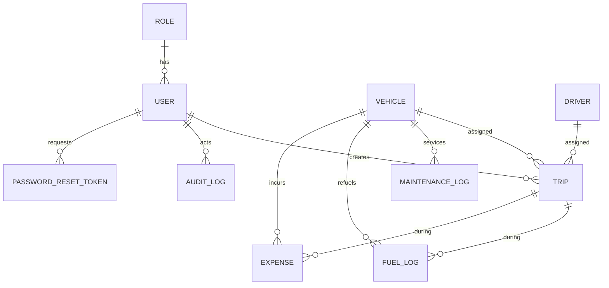

# TransitOps

### **Live application: https://odoo-seven-phi.vercel.app**

Transport operations platform for managing the full lifecycle of a vehicle fleet — registry, drivers, dispatch, maintenance, fuel and expenses, and analytics — with business rules enforced server-side.

---

## Overview

Logistics operators typically run on spreadsheets, which leads to double-booked drivers, missed maintenance, expired licences and no cost visibility. TransitOps centralises the whole operation and makes the rules non-negotiable: a vehicle cannot be dispatched while it is in the shop, a driver with an expired licence cannot be assigned, and cargo cannot exceed a vehicle's rated capacity.

---

## Tech Stack

| Layer | Technology |
| --- | --- |
| Framework | Next.js 16 (App Router), React 19, TypeScript |
| Styling | Tailwind CSS v4, Framer Motion |
| Database | PostgreSQL (Neon) |
| ORM | Prisma 6 — engine-free client with the `pg` driver adapter |
| Auth | bcrypt, JWT session cookie (jose), edge middleware |
| Validation | Zod, at every API boundary |
| Charts / 3D | Recharts, React Three Fiber, CSS 3D |
| Email | Nodemailer (SMTP) |
| Hosting | Vercel |

---

## Architecture

Layered, with no database access inside route handlers.

```
Request
  -> middleware              session gate
  -> app/api/**/route.ts     parse, validate (Zod), authorise (RBAC), delegate
  -> lib/services/*          business rules, transactions, audit trail
  -> lib/db.ts (Prisma)      data access
```

```
src/
  app/
    (app)/        authenticated pages
    api/          route handlers
    login/ signup/ forgot-password/ reset-password/
  lib/
    services/     business logic, one module per domain
    validation/   Zod schemas
    auth/         session, password, RBAC
    api/          response envelope, error handling, route guard
  components/
    ui/           design system
    layout/       shell, navigation
prisma/
  schema.prisma
  migrations/
  seed.ts
```

Every endpoint returns one envelope: `{ ok: true, data }` or `{ ok: false, error }`. Validation, business-rule and Prisma errors are translated centrally into readable messages.

---

## Database

Money is `DECIMAL(12,2)`, statuses are enums, foreign keys are enforced, every table carries `created_at` / `updated_at`, and indexes cover foreign keys and frequently filtered columns. An append-only `audit_logs` table records every state change.



---

## Business Rules

Enforced in the service layer, inside transactions.

- Vehicle registration numbers are unique.
- Retired and in-shop vehicles never appear in the dispatch pool.
- Drivers who are suspended, off duty, already on a trip, or whose licence has expired cannot be assigned.
- Cargo weight must not exceed the vehicle's maximum load capacity.
- Dispatching a trip sets both the vehicle and the driver to On Trip.
- Completing or cancelling a trip returns both to Available.
- Opening a maintenance record sets the vehicle to In Shop and removes it from dispatch.
- Closing the last open maintenance record restores the vehicle to Available, unless it is retired.

---

## Access Control

| Module | Fleet Manager | Driver | Safety Officer | Financial Analyst |
| --- | --- | --- | --- | --- |
| Dashboard | View | View | View | View |
| Vehicles | Edit | View | View | View |
| Drivers | View | View | Edit | View |
| Trips | View | Edit | View | View |
| Maintenance | Edit | View | View | View |
| Fuel and Expenses | View | Edit | — | Edit |
| Reports | View | View | View | View |
| Settings | Edit | — | — | — |

The matrix is fixed in the backend and enforced on every request. It is intentionally not editable at runtime, so no role can widen its own permissions. What a Fleet Manager controls is **who holds which role** — users can be created and reassigned from Settings, and access changes take effect immediately.

**Security:** passwords are bcrypt-hashed; sessions are signed JWTs; accounts lock for 15 minutes after 5 consecutive failed logins; password-reset tokens are single-use, expire in 60 minutes and are stored hashed.

---

## Demo Accounts

Password for all accounts: `Transit@2026`

| Email | Role |
| --- | --- |
| kavish@gmail.com | Fleet Manager |
| vatsal@gmail.com | Driver |
| harsh@gmail.com | Safety Officer |
| keval@gmail.com | Financial Analyst |

---

## Getting Started

Requires Node.js 20+ and a PostgreSQL database.

```bash
npm install                 # generates the Prisma client
cp .env.example .env        # set DATABASE_URL and AUTH_SECRET
npm run db:migrate
npm run db:seed
npm run dev                 # http://localhost:3000
```

### Environment

| Variable | Purpose |
| --- | --- |
| `DATABASE_URL` | PostgreSQL connection string |
| `AUTH_SECRET` | Signing key for session tokens |
| `SMTP_USER`, `SMTP_PASS` | SMTP credentials for password-reset email (optional) |

---

## Scripts

| Command | Description |
| --- | --- |
| `npm run dev` | Start the development server |
| `npm run build` | Production build |
| `npm run db:migrate` | Create and apply a migration |
| `npm run db:seed` | Seed demo data |
| `npm run db:reset` | Reset the database and reseed |
